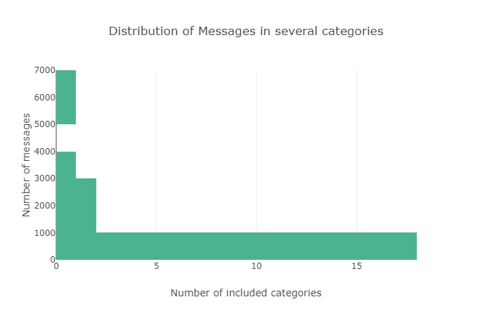
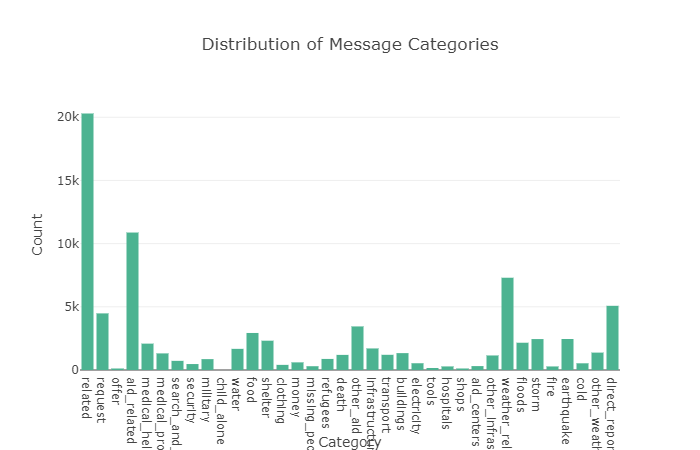
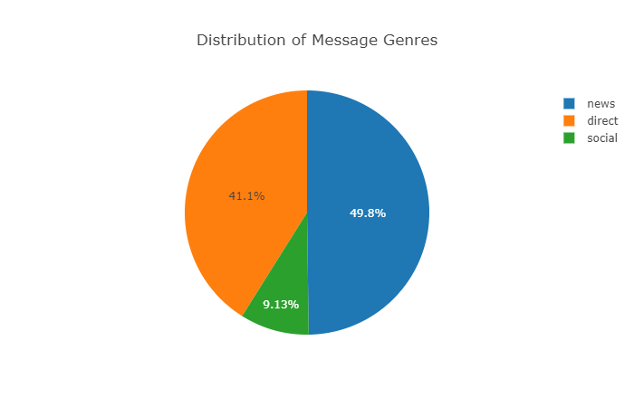
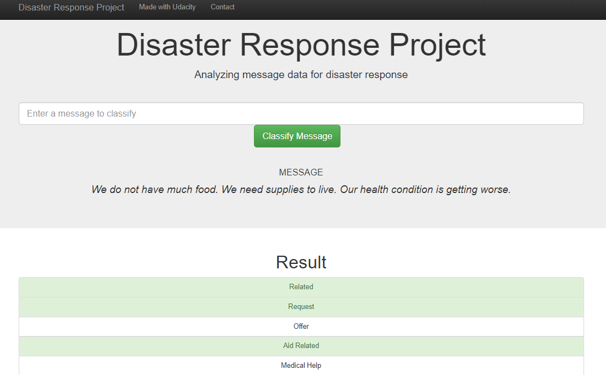

# Disaster-Response-Pipeline
This is the project repo for the Udacity project Assignment for Disaster Response Pipeline for the course Data Scientist Nanodegree.    
The motivation behind this machine learning project is to build a web application that classifies text messages received in the event of a disaster such as during storms or earthquakes.   \
The web application can be used by emergency workers to classify messages, and this could be essential for appropriate disaster relief agency. The output of the ML model is a classification of the message into several categories such as water, shelter, food and clothing. Such a classification would give the app user a better awareness on what kind of help/aid is needed in case of emergency.   \
We will train on data set containing real messages that were sent during disaster events from Figure Eight.

## Table Of Contents  
* [Project Organization](#prjorg)  
* [Graphs](#graphs)  
* [Web App Screenshot](#websc)  
* [Prerequisites](#prerequisite)
* [Running the Application](#running)  

## Project Organization
The project is divided into 3 parts.
1.  ETL Pipeline Data cleaning pipeline contained in Data/process_data.py:
* This pipeline loads the messages and categories datasets, Merges the two datasets.
* Cleans the data and stores it in a SQLite database.

2. ML Pipeline Machine learning pipeline contained in Models/train_classifier.py:
* Loads data from the SQLite database, splits the dataset into training and test sets.
* Builds a text processing and machine learning pipeline.
* Trains and tunes a model using GridSearchCV and exports the final model as a pickle file.

3. Flask Web App Web app where an emergency worker can input a new message and get classification results in several categories. The web app also displays visualizations of the data.

## Graphs

## Web App Screenshot

## Prerequisites
* Pandas
* Numpy
* NLTK
* Flask
* Plotly
* Sklearn
* Sqlalchemy
* Pickle
* re
* os
* sys

## Running the Application
Run the following commands in the project's root directory to set up your database and model.  
* To run ETL pipeline that cleans data and stores in database python Data/process_data.py Data/disaster_messages.csv Data/disaster_categories.csv Data/DisasterResponse.db
* To run ML pipeline that trains classifier and saves python Models/train_classifier.py Data/DisasterResponse.db Models/classifier.pkl
* Run the following command in the app's directory to run your web app. python run.py
* Go to http://0.0.0.0:3001/ OR http:localhost:3001
